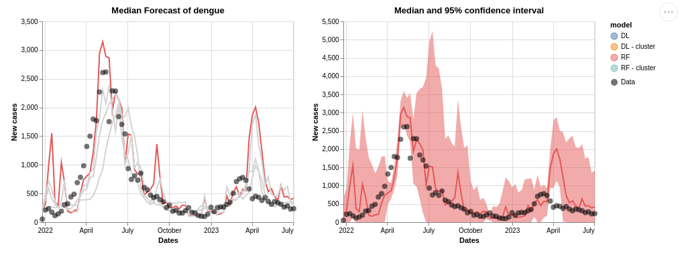

# visualization
In this repo, we prototype visualizations for the data available on the mosqlimate platform.

By now, the visualizations are separated by what they want to show. Plots to show cases/incidences are in the cases folder, and plots to show forecasts are in the forecasts folder. Each folder contains jupyter notebooks to generate the plots, a folder called `data` where the data needed to make the plot is saved,  a folder called `files_html` where you can save the HTML file of your graph if possible, and a folder called `figures` where you can save the png of your plots.

## Cases visualizations

There is available the code to generate the following figures:

* In the `altair_map.ipynb` a choropleth map of dengue incidence using the package altair:  

This kind of plot is interesting to see the spatial distribution of dengue cases. 

* In the `bokeh_map.ipynb` a choropleth map of dengue incidence using the package bokeh: 

This kind of plot is interesting to see the spatial distribution of dengue cases.

* In the `plotly_map.ipynb`, a choropleth map animation of dengue incidence over the years using the package plotly:  

This kind of animation is helpful to see the spatio-temporal evolution of dengue cases.

* In the `heatmap_altair.ipynb` a heatmap of dengue incidence over the years using the package altair:  

This kind of plot is interesting to see the spatio-temporal evolution of dengue cases.

* In the `cases_by_week.ipynb` a heatmap of dengue incidence over the years using the package altair:  

This plot is helpful to see the temporal evolution of dengue cases in the different seasons.

## Forecasts visualizations 

* In the `plot_forecast_altair.ipynb` a plot of forecasts of new cases:  

This kind of plot is interesting to compare the performance of different forecast models.

