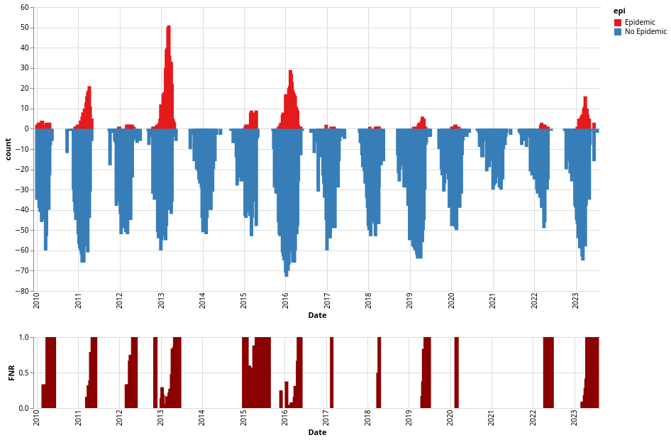

# Classificadores espaciais

No Notebook [stream_plot.ipynb](cases/stream_plot.ipynb), Visualizamos o resultado de um classificador de receptividade que busca idenfificar municípios com transmissão sustentada. Podemos visualiza o resultado ao longo do tempo ou no mapa como métricas agregadas do modelo.

Na figura acima, o painel superior representa as previsões do modelo, em vermelho os municípios com transmissão sustentada e em azul os municípios sem transmissão sustentada. O painel inferior representa representa os falsos negativos do modelo, isto é, municípios com transmissão sustentada que não foram identificados pelo modelo.

## Visualizando métricas
Várias métricas podem ser representadas espacialmente, como forma de aferição do modelo. Por exemplo, abaixo temos um mapa da acurácia do modelo em todo o período em que foi aplicado.

Também podemos obter o mapa do Mathews Correlation Coefficient (MCC), que é uma métrica que leva em consideração os falsos positivos e falsos negativos do modelo.

ou ainda uma visualização da revocação (recall) do modelo.

